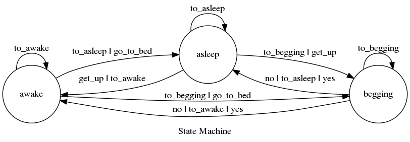

# Flask-ask with State Machine for use in Alexa Skills

After using [dgtony](https://github.com/dgtony)'s [AFG](https://github.com/dgtony/afg) for scenario-based
dialogues I became more interested in using a state machine for managing
conversation state. In this example I use the python library [transitions](https://github.com/tyarkoni/transitions)
to handle all the heavy lifting.

## Example Model
This is the model used in the example. Such diagrams can be made by the machine itself:

##Benefits:

1. It is much simpler to reason about the conversational flow when using
a state machine.

2. Most state machine libraries have a logging ability. This will be 
incredibly useful for keeping track of how users interact with
your skill.

Feel free to create issues if you have questions or comments!
